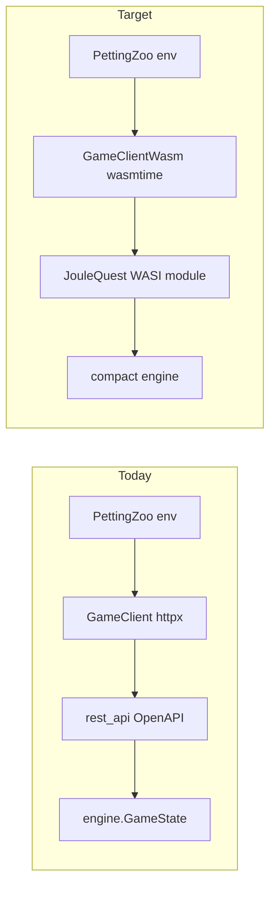

# WASM in-process bridge for RL training

## Context (current system)

- Python ([`rl_agent/game_client.py`](rl_agent/game_client.py)) uses synchronous OpenAPI client calls over UDS via httpx, which serializes work and pays JSON costs.
- The Go engine’s interactive path is [`ProceduralGameState`](src/engine/procedural.go): build phase actions via `ApplyPlayerAction`, then `runUntilBuildPhase` runs `OperatePhase` when the round advances—this is the right control inversion to mirror in WASM.
- Core state today lives in [`GameState`](src/engine/game_state.go) / [`PlayerState`](src/engine/game_state.go) with **slices of `assets.Asset`**, [`possibleActions`](src/engine/build.go) building a **new `[]PlayerAction` every call**—that allocation-heavy shape is still awkward for WASM even though operate-phase risk now uses **`math/rand/v2.PCG`** on `GameState` ([`SetRNGSeed`](src/engine/game_state.go), same draw pattern as compact).

## Step 0 — Rules and architecture note

**Cursor rules** (e.g. [`.cursor/rules/`](.cursor/rules/) with path globs):

- **Go compiled for WASI / training engine**: no goroutines, channels, or `select`; avoid `fmt`/`string` in exported hot paths; prefer `int32` for exported surfaces; no reliance on package `init` that spawns background work; keep globals to the documented singleton game/params; document `//go:wasmexport` signature limits (Go 1.24 requires WASM-friendly parameter/return types—stick to `int32`/`uint32` as you proposed).
- **Python `rl_agent/`**: use **uv** for installs/scripts; new client code targets **wasmtime** (or chosen runtime) rather than httpx for game stepping.
- **Parity tests and reference engine**: [`ProceduralGameState`](src/engine/procedural.go) / [`GameState`](src/engine/game_state.go) are legacy of exploratory rule design and carry implementation quirks. **Do not** treat their internal representations (e.g. slice ordering in the takeover pool) as the ground truth for parity. Ground truth is the **training-observable surface**: what [`rest_api`](src/cmd/rest_api/main.go) puts on the wire (e.g. [`stateResponse`](src/cmd/rest_api/main.go) — status, reason, round, emissions, players as serialized, `LastRoundSnapshot`, **`TakeoverPool` as `assets.AssetMix`**) and what the WASM module will export as scalars—because **that** is what RL agents can observe (Python never sees per-asset ordering in the pool today). When parity fails and the cause looks like **order dependence**, **mismatched PCG seeding or extra draws** between harnesses, or other reference quirks, **stop and ask the project owner** before weakening tests or adding hacks; the owner may update the existing Go code so parity can be written cleanly.
- **Scope**: these rules describe *this* WASM training interface effort—not generic “always write tests” guidance.

**Architecture document** at repo root next to [`README.md`](README.md) (name e.g. `WASM_TRAINING_INTERFACE.md`):

- **Problem**: REST+JSON+sync client bottlenecks multi-env training.
- **Approach**: single-threaded **WASI reactor** module per process/thread, **client-driven** build phase (same idea as `ProceduralGameState`), **scalar exports only** so Python never unmarshals game JSON.
- **Semantics**: one hidden global game + params in the module; Python calls `_initialize` (WASI reactor) then `Reset` / `ApplyAction` / getters; **no event log** in this build (training does not consume [`get_log`](rl_agent/game_client.py)).
- **Build**: document Go **1.24** command line using **WASI reactor** mode and `//go:wasmexport` (official story: `GOOS=wasip1 GOARCH=wasm go build -buildmode=c-shared`, call module `_initialize` before exports—see [Extensible Wasm Applications with Go](https://go.dev/blog/wasmexport)).
- **Tradeoffs**: WASM binary size vs TinyGo (optional future); parity still needs an explicit **shared seed contract** (`SetRNGSeed`) across reference, compact, and WASM exports.
- **Parity with today’s stack**: WASM is meant to give Python a **similar** contract to OpenAPI, not to freeze every internal detail of `GameState`. Contract-level parity (what agents observe) matters more than matching slice layouts.

## Step 1 — Compact, training-only engine (alongside existing code)

Add a **new package** under [`src/`](src/) (e.g. `engine/traincompact` or `engine/compact`) that **does not replace** the current engine used by `rest_api`.

**Layout / types**

- **`MaxPlayers = 10`**: fixed `[MaxPlayers]playerState` with **`numPlayers` int**; all unused slots inert.
- **Assets**: do **not** use `[]Asset` pointers. A **5-bucket mix** matching [`assets.AssetMix`](src/assets/asset_mix.go) is necessary (renewable / battery arb / battery cap / fossil wholesale / fossil cap)—*not* “three asset types only,” or pledge and PnL break.
- **Takeover pool**: model it with **one `AssetMix`-shaped struct** (same five counters as player assets). It holds **unowned** assets moved from bankrupt players, **including the mode split** (wholesale vs capacity) they had when they entered the pool—**order does not matter**; only counts per bucket matter. This keeps the type surface small (reuse the same mix type mentally and in code) and is a deliberate **simplification** versus today’s slice of pointers + `slices.IndexFunc` ordering in [`applyPlayerAction`](src/engine/build.go).
  - **[`TakeoverRuleForcedTakeover`](src/params/params.go)**: pool must be **all zeros** before a player can finish the build round (same rule as today); possible actions and loss conditions follow from “non-empty pool with no affordable takeover.”
  - **[`TakeoverRuleVirtualOwner`](src/params/params.go)**: the pool mix contributes to **grid / emissions** like other unowned assets; mode buckets still matter here because those assets operate without a player owner.
  - **Takeover by a player**: when an asset leaves the pool for a portfolio, treat it as **default mode** (same as today’s `assets.New` / post-takeover behavior); the compact engine should **not** need “un-pledge” handling for pool assets because pool semantics are not tied to per-slot mode once transferred—align with existing “reset modes at build start” behavior.
- **Params**: mirror [`params.Params`](src/params/params.go) but **remove maps**: replace `StartingFossilAssetsPerPlayer map[int]int` with **`[MaxPlayers+1]int32`** (index = player count), and keep PnL tables as **`[4]int32`** (already [`core.PnLTable`](src/core/core.go) compatible).
- **Numeric widths**: use `int32` (or `int` internally where Go idiom is safer) for fields that cross the WASM boundary; stay within ranges the Python env already assumes (e.g. money in observation space).
- **Control flow**: duplicate the **state machine subset** used by `ProceduralGameState`—build → operate → build—**without** `eventlog.Logger` (pass a zero/no-op pattern or strip logging calls entirely in this package).

**Allocation discipline**

- Replace `possibleActions []PlayerAction` + `slices.Contains` with:
  - **`PossibleActionMask(playerIndex int32) uint32`** (15 bits aligned with [`PlayerActionToInt`](rl_agent/custom_environment/env/joulequest_env.py)), and
  - **validation inside `ApplyAction`** that recomputes the mask bit for the decoded action instead of allocating slices.
- **RNG**: reference and compact already keep **PCG** on the game struct with **`SetRNGSeed(uint64)`**; the WASM module should expose a matching seed hook (e.g. **`SetSeed64(lo, hi)`** or a single-word mapping) so hosts can stay aligned with parity tests and RL.

**Parity tests (Go) — motivation and scope**

- **Why these tests exist**: the WASM module should be a **drop-in engine** behind the same conceptual API Python already uses against the OpenAPI server. Training code must keep seeing **the same information** it already can: nothing more, nothing less, from the host’s point of view.
- **What agents actually observe**: the REST layer already defines the relevant shape. In [`rest_api`](src/cmd/rest_api/main.go), [`stateResponse`](src/cmd/rest_api/main.go) exposes game status, reason, round, emissions, players (JSON-marshaled [`PlayerState`](src/engine/game_state.go) — including money, status, and **`assets.AssetMix` for holdings**), last-round snapshot, and **`TakeoverPool` as `assets.AssetMix`**. There is **no ordering** exposed for pool assets—only counts per bucket—so parity assertions should be framed in terms of that **API-visible surface** and the **eventual WASM scalar getters**, not incidental details of how [`GameState`](src/engine/game_state.go) stores slices internally.
- **Reference implementation caveat**: `ProceduralGameState` / `GameState` grew through exploratory design; they are the **convenient mechanical oracle** to drive with the same action stream, not a spec for internal representation. When tests disagree with the compact engine, prefer checking whether the **observable** state matches; if the mismatch traces to **slice order**, **PCG state divergence** (seed or number of draws), or other legacy quirks, **do not paper over it**—**ask the project owner** whether to adjust the existing engine so tests and WASM stay aligned.

**Parity tests (Go) — mechanics**

- In the same module or `_test.go`, add tests that **drive reference `ProceduralGameState`** (with a no-op / discarding logger) and the compact engine with the **same params, `SetRNGSeed` value, and action stream**.
- After each step, compare fields that match **OpenAPI / RL observability**: game status, reason, round, emissions counter, last snapshot’s asset mix + grid/price enums, each player’s status, money, and **asset mix**, **takeover pool as five bucket counts**, and **per-player legal action masks** (same 15-way encoding as the PettingZoo env). Derive the reference side’s expected mix for players and pool the same way the API does (e.g. marshaling uses [`getAssetMix`](src/engine/game_state.go) for players), not raw slice indices.
- Start from smaller scenarios (single-player build quirks, takeover pool forced rule, pledge eligibility) and grow to randomized action sequences. If a mismatch appears **only** because slice order in the reference engine changed which concrete asset moved while **all `AssetMix` counts stay identical**, treat that as a **reference implementation** issue to fix or discuss with the owner—not a reason to complicate the compact/WASM design.

## Step 2 — WASM client library (Go)

New **`main` package** for the reactor (e.g. [`src/cmd/joulequest_wasm/main.go`](src/cmd/joulequest_wasm/main.go)) that:

- Holds **package-level** `params` + `game` instances of the compact types.
- Exposes **`//go:wasmexport`** functions only with **fixed integer signatures**, for example:
  - Lifecycle: `InitDefaultParams`, `Reset(numPlayers int32) int32` (error code), optional param setters if training needs non-default configs later.
  - Step: `ApplyAction(playerIndex int32, actionInt int32) int32` (reuse the 0–14 mapping from the PettingZoo env).
  - Queries: `NumPlayers`, `GameStatus`, `GameReason`, `Round`, `Emissions`, snapshot fields, per-player `Money`, `PlayerStatus`, each of the five asset counts, `PossibleActionsMask(playerIndex)`, `Takeover*` getters, internal phase if needed for debugging.
- Maps errors to **`int32` codes** (success / invalid action / wrong phase / bad index) instead of returning strings.

**Docs** in the architecture file or a short `README` next to the cmd: exact `go build` line, expectation to invoke `_initialize`, and notes on **reactor** vs command-style WASM.

**Size note**: first milestone can accept **official Go WASI** binary size; if it is too large for your training scale, add a follow-up task to try **TinyGo** against the same compact code (may require additional language restrictions).

## Step 3 — Python wasmtime `GameClient` + enum codegen

**Python client**

- New class (parallel to [`GameClient`](rl_agent/game_client.py)) that accepts a **loaded wasmtime module/instance** (or a small factory) instead of `joule_quest_api_client.Client`.
- Implement the same operations the env needs: **reset**, **send action**, **read game + possible actions**; implement `possible_actions` as a list of lightweight **dataclass/namedtuple** objects **constructed from masks** (player index + action int), not from pydantic OpenAPI models—so [`joulequest_env.py`](rl_agent/custom_environment/env/joulequest_env.py) can drop the hard dependency on `apiclient` for stepping (OpenAPI may remain for other tools).
- `get_log` can return **`""`** or raise `NotImplementedError` with a clear message—training path does not need logs.

**Enum generation (`go generate`)**

- Add a small Go tool under e.g. [`src/cmd/genpyenums/`](src/cmd/genpyenums/) invoked via `//go:generate` from a single “manifest” file listing **which enum types** must stay aligned (engine `GameStatus`, `LossCondition`, `PlayerStatus`; core grid/price enums; OpenAPI `PlayerActionType` / `PlayerActionAssetType` if you keep separate dimensions, or the **combined 0–14 action space** only).
- Implementation approach: use **`go/types`** loading the module to resolve `const` blocks and numeric values, emit a Python `IntEnum` / `StrEnum` file into `rl_agent/.../generated/` with a **stable header** (`// Code generated... DO NOT EDIT`).
- Wire [`joulequest_env.py`](rl_agent/custom_environment/env/joulequest_env.py) to import generated enums and delete hand-maintained duplicates where safe.

**Dependencies**

- Add **wasmtime** (PyPI) via **uv** in [`rl_agent`](rl_agent) project metadata.

## Suggested implementation order

1. **Compact engine + parity tests** (highest risk; proves WASM work is worthwhile).
2. **WASM exports + minimal Python smoke** (load module, reset, one action, read getters).
3. **Enum generator + env refactor** to use wasm client and generated types.
4. **Rules + architecture doc** can land early in parallel with (1) so agents don’t drift.

## Key risks / decisions baked into this plan

- **Parity test ground truth**: compare **OpenAPI/WASM-visible state** (e.g. [`stateResponse`](src/cmd/rest_api/main.go)), not `GameState` internals. Agents implementing tests should **escalate** ordering, seeding, or other reference quirks to the owner instead of weakening assertions.
- **Takeover representation**: multiset (`AssetMix`-shaped pool) is **canonical** for the training/WASM engine; order is explicitly irrelevant. Parity tests validate observables under this model. If the REST/slice engine ever disagrees in an edge case, prefer **aligning the slice engine** to multiset semantics (or accept a documented divergence) rather than adding a second, heavier representation for WASM.
- **Go WASM export typing**: stay within documented WASM-signature limits; if a needed function can’t be exported, split into multiple `int32` getters.
- **Randomness**: operate-phase draws use **PCG on `GameState`** in the reference ([`OperatePhase`](src/engine/operation.go)); compact mirrors that. WASM must keep **explicit, seedable state** (no implicit package-level RNG) for tests and RL.
