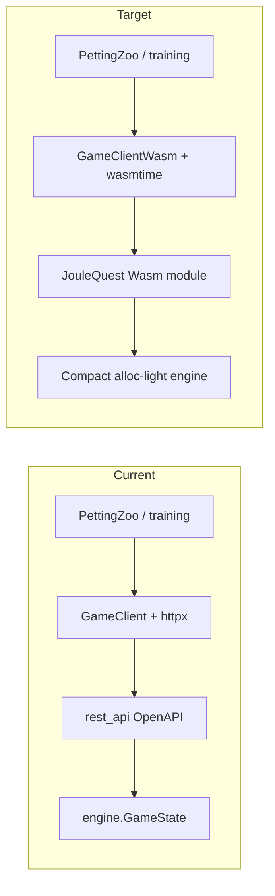

# WASM training interface

This document describes the **in-process WebAssembly (WASI)** bridge between the JouleQuest game engine (Go) and the RL training stack (Python). It complements the top-level [README.md](README.md). Cursor rules live under [.cursor/rules/](.cursor/rules/) — including [`joulequest-wasm-training.mdc`](.cursor/rules/joulequest-wasm-training.mdc) for this bridge and [`rl-agent-python.mdc`](.cursor/rules/rl-agent-python.mdc) for general Python in `rl_agent/`.

## Problem

Training uses Python in [`rl_agent/`](rl_agent/) and today talks to the Go game through the **OpenAPI REST server** ([`src/cmd/rest_api/`](src/cmd/rest_api/)) over a Unix socket, via a synchronous **httpx** client ([`rl_agent/game_client.py`](rl_agent/game_client.py)). That pattern tends to be **single-threaded on the Python side**, and pays repeated **JSON encode/decode** cost for every action and observation.

## Goal

Provide a **similar conceptual API** for Python as the OpenAPI server (reset game, submit actions, read state and legal actions), but backed by a **WebAssembly module** (built with **TinyGo**, e.g. **`wasm-unknown`** reactor target) loaded in-process (e.g. **wasmtime**), with **scalar** host calls instead of REST bodies.

## Architectural approach

- **Client-driven control**: mirror [`ProceduralGameState`](src/engine/procedural.go) — the host chooses build-phase actions; the engine advances until the next decision point (same inversion as moving away from `GetPlayerAction` callbacks).
- **One module instance per worker**: no need for goroutines, channels, or concurrency **inside** the WASM library; Python may spawn one instance per process/thread as needed.
- **Singleton state in the module**: a single global **params** struct and a single global **game** struct, with exported functions to reset, apply an action, and read fields.
- **No event log** on this path: training does not rely on [`get_log`](rl_agent/game_client.py); the WASM build can omit logging entirely.

## Contract parity (what RL can observe)

The WASM exports should match **what training already sees through the API**, not every internal detail of [`GameState`](src/engine/game_state.go).

The REST layer defines the relevant shape. For example, [`stateResponse`](src/cmd/rest_api/main.go) includes:

- Game: status, reason, round, emissions counter  
- Players: serialized [`PlayerState`](src/engine/game_state.go) (money, status, holdings as **`assets.AssetMix`**)  
- Last round snapshot  
- **`TakeoverPool` as `assets.AssetMix`**

There is **no ordering** for takeover-pool assets on the wire — only **counts per bucket**. Parity tests and the compact engine should treat that **AssetMix-shaped multiset** as canonical for the pool.

The reference `GameState` / `ProceduralGameState` code paths are a **mechanical oracle** for tests; they grew through exploratory design and may have internal quirks (e.g. slice order). If tests disagree with the compact engine only on **non-observable** internals, **escalate to the maintainer** rather than papering over differences; the reference implementation may be updated so parity stays aligned with the API contract.

## WASM export shape (planned)

- **Parameters and returns**: fixed-width integers (`int32` / `uint32` as needed). Prefer **one `int32` return** per function (data or error code) and **integer-only arguments**, as required for a simple host FFI.
- **Actions**: encode build-phase choices in the same **0–14 integer space** as [`rl_agent/custom_environment/env/joulequest_env.py`](rl_agent/custom_environment/env/joulequest_env.py) (`PlayerActionToInt`).
- **Legal actions**: expose a **bitfield per player** (15 bits) instead of marshaling a list of `PlayerAction` structs.
- **Player-scoped getters** take an explicit **player index**; include **number of players**.

Errors map to **integer codes** (invalid action, wrong phase, bad index, etc.), not JSON error strings.

## Takeover rules (design alignment)

- **[`TakeoverRuleForcedTakeover`](src/params/params.go)**: pool must be **empty** (all mix counts zero) before a player may finish the build round when the rules require it; stale assets in the pool with no affordable takeover lead to the same loss outcomes as today.
- **[`TakeoverRuleVirtualOwner`](src/params/params.go)**: unowned pool assets contribute to **grid / emissions**; the **five-bucket** mix (including wholesale vs capacity) matters for those calculations.
- **Takeover into a portfolio**: assets enter the player’s portfolio in **default mode**, consistent with current `assets.New` behavior after takeover.

## Building the module (TinyGo)

The **planned** toolchain for the training WASM binary is a **recent [TinyGo](https://tinygo.org/)** release (see [TinyGo releases](https://github.com/tinygo-org/tinygo/releases)), for **small modules** and a **stricter, embed-friendly** subset of Go than the main `gc` compiler’s WASI port.

### `//go:wasmexport` (aligned with `gc` Go)

Since **TinyGo 0.34**, TinyGo supports **`//go:wasmexport`** the same way as upstream Go, so export signatures can stay **source-compatible** with a `GOOS=wasip1` / `GOARCH=wasm` `gc` build for the same entrypoints ([Extensible Wasm Applications with Go](https://go.dev/blog/wasmexport) describes the directive). **This repo should use `//go:wasmexport`** for exported game API functions—not the older **`//go:export`** style—unless you are deliberately matching legacy host shims.

### Reactor-style `wasm-unknown` modules

For a **library-style (reactor) module** that stays loaded while the host calls exports repeatedly, use TinyGo’s **`wasm-unknown`** target (see the upstream example [`hello-wasm-unknown/main.go`](https://github.com/tinygo-org/tinygo/blob/v0.40.1/src/examples/hello-wasm-unknown/main.go) for layout and `tinygo build` flags; the checked-in example may still use **`//go:export`**, but **this repo** should use **`//go:wasmexport`** as above). The reference build line is:

`tinygo build -size short -o hello-unknown.wasm -target wasm-unknown -gc=leaking -no-debug …`

That pattern (`wasm32-unknown-unknown`, empty or minimal `main`) matches how **wasmtime** (and similar hosts) embed a long-lived module. Exact flags for JouleQuest will live next to the WASM `cmd/` once it exists ([`src/cmd/joulequest_wasm/`](src/cmd/joulequest_wasm/) per plan); keep **`-target=wasm-unknown`** (with hyphen) unless TinyGo’s docs for your version specify otherwise.

### `gc` WASI as reference only

Upstream **Go 1.24+** `GOOS=wasip1` + **`//go:wasmexport`** remains useful for **cross-checking** semantics and CI, but **shipping** the training artifact is planned via **TinyGo** as above.

## Python side (planned)

- Use **uv** for **rl_agent** installs and scripts (see [`.cursor/rules/rl-agent-python.mdc`](.cursor/rules/rl-agent-python.mdc)).
- A **GameClientWasm** (or equivalent) accepts a **wasmtime** module/instance and implements the same operations the PettingZoo env needs: reset, step with action int, read state and masks. **`get_log`** may return an empty string or be omitted for training.
- **Enums**: generated or shared definitions kept in sync with Go (see plan: `go generate` + small Go tool emitting Python).

## Tradeoffs and follow-ups

- **Binary size / toolchain**: the training WASM module is planned to be built with **TinyGo** (≥ **0.34** so **`//go:wasmexport`** is available), **`wasm-unknown`** reactor builds, prioritizing a **small binary** and alignment with the compact engine’s constraints. Stay within **TinyGo-supported stdlib and language features** (see [.cursor/rules/joulequest-wasm-training.mdc](.cursor/rules/joulequest-wasm-training.mdc)).
- **Randomness**: [`OperatePhase`](src/engine/operation.go) and the compact engine both use **`math/rand/v2.PCG`** on game state for operate-phase draws, with **`SetRNGSeed(uint64)`** on [`GameState`](src/engine/game_state.go) and [`compact/game.Game`](src/compact/game/operate.go) so parity tests and RL can fix the sequence the same way on both sides.

## Roadmap (remainder of project)

Tracked in the repo plan *WASM FFI training bridge*:

1. **Compact engine** — implemented under [`src/compact/params`](src/compact/params) (fixed `CompactParams`) and [`src/compact/game`](src/compact/game) (procedural `Game`, build masks 0–14, operate phase, seeded RNG). 
2. **Go parity tests** — same seeds and action streams vs `ProceduralGameState`, comparing **OpenAPI-visible** fields and masks.  
3. **`src/compact/client`** — TinyGo **`wasm-unknown`** reactor build + **`//go:wasmexport`** API (TinyGo ≥ 0.34).  
4. **Python wasmtime client** + optional **enum codegen** from Go.
